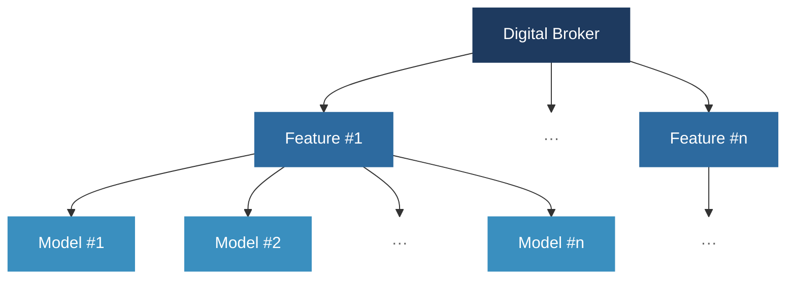
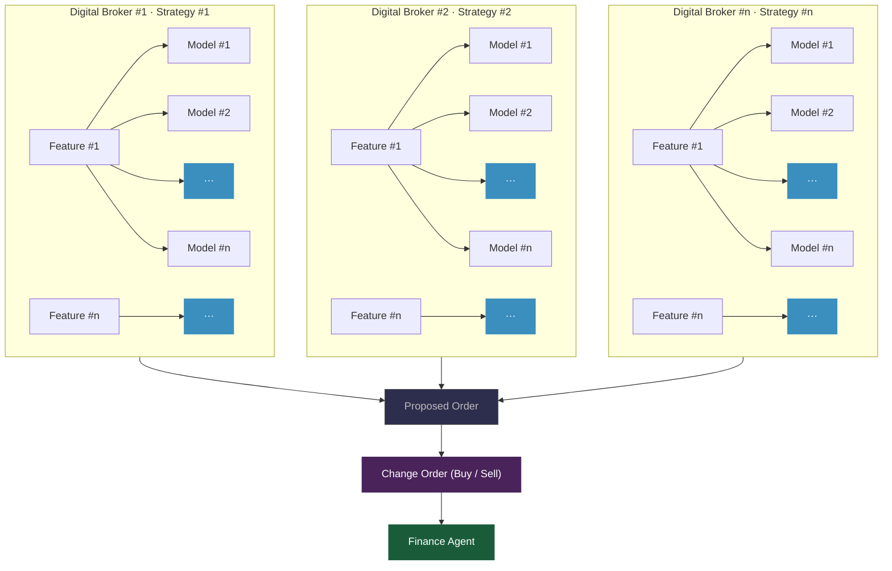
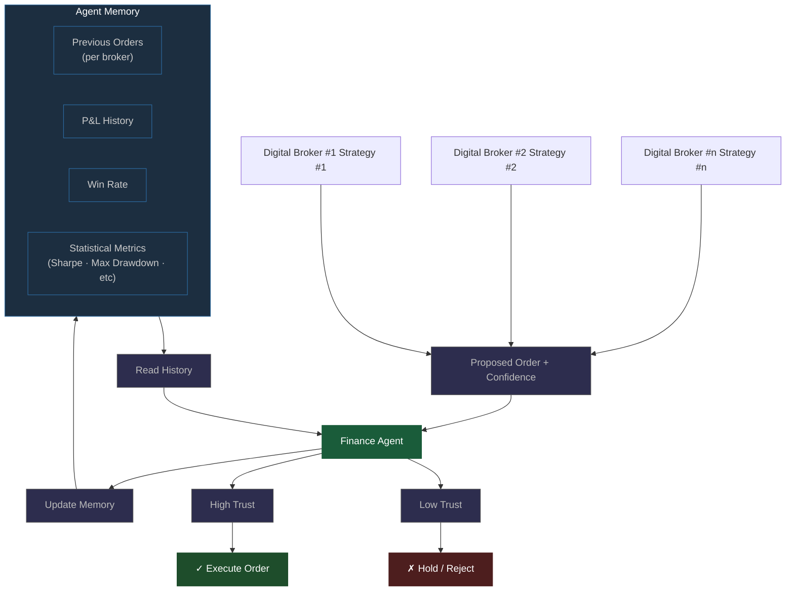

# Catfish

> A finance trend forecasting & trading multimodel framework.

---

## Trading Strategy

Catfish is a distributed, horizontally scalable trading system with strategy-partitioned agents, self-regulating execution logic, and local/global performance caching for validated order execution across multiple trading horizons.

The goal of the **Digital Broker** is to analyse the scale and validity of each model's predictions, weigh the impact of each model, and reason towards a potential buy or sell order.

---

## Multi-Broker Moots (MBMs)

Catfish runs multiple Digital Brokers in parallel, each dedicated to a distinct trading strategy with its own hierarchy of features and underlying models. Rather than operating in isolation, the brokers are deployed simultaneously across many relevant stock options in relation to the primary change order, with each broker working to validate or disprove the proposed actions of the others before any official request is committed. This mutual scrutiny ensures that no single strategy can unilaterally drive an execution, and that the system as a whole remains robust to the failure or overconfidence of any one model ensemble. The outputs of all active brokers are then consolidated into a single change order node, which is forwarded to the Finance Agent for final adjudication.

> **Note:** The implementation of MBMs is user-dependent, but is currently focused on **NASDAQ index funds**.

---

## Exposure × Financial Analysis Automation

The Finance Agent serves as the final arbiter across all incoming change orders, receiving a proposed order alongside a confidence signal from every active Digital Broker simultaneously. Rather than evaluating each proposed order in isolation, the agent maintains a persistent memory of the historical performance of each broker, drawing on records of previous orders, cumulative profit and loss, win rate, and a broader suite of statistical measures, including Sharpe ratio and maximum drawdown, in order to construct a current trust weighting for each broker. 

The agent thus weighs not only the content of each proposed order but also the established track record of the strategy that produced it; a broker with a strong and consistent history of profitable decisions will carry greater influence over the final outcome than one whose recent performance has been poor or erratic. Orders whose weighted trust clears the agent's confidence threshold are forwarded for execution, whilst those that fall below are held or rejected outright. The agent's memory is updated after every resolved order, ensuring that trust weightings remain responsive to each broker's most recent behaviour rather than relying solely on static historical averages.

To further reduce execution risk, fundamental statistical testing is applied to any outgoing buy order to confirm its financial stability with respect to both the **value** and **flexibility** of the current portfolio prior to settlement.
